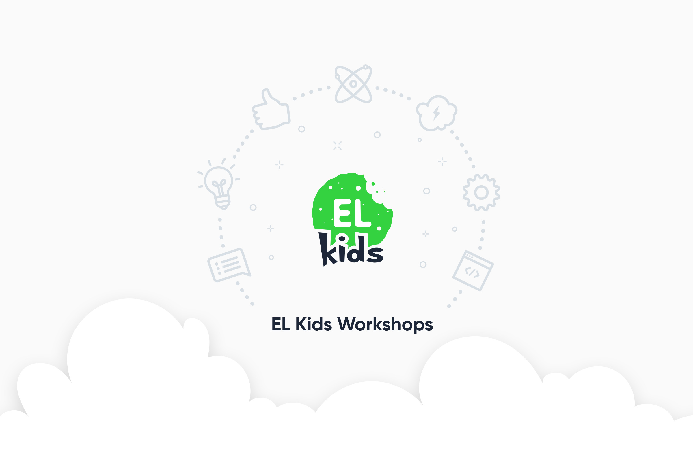

# EL Kids / ArduBerek

Ćwiczenie programistyczno-robotyczne dla dzieci z wykorzystaniem robotów 
opartych o Arduino.

## Założenia

* Cele:

  * Pokazanie dzieciom jak wygląda *prawdziwe* programowanie. Czyli na możliwie
    jak najniższym poziomie, gdzie polecenia wpisuje się już ręcznie w IDE,
    a nie "wyklikuje" jak np. w Scratchu.
  
  * Pokazanie dzieciom, że działanie robotów i zabawek typu "Furby" to nie jest 
    magia - tylko działanie określonych sensorów i algorytmów.
    
  * Umożliwienie dzieciom dalszej zabawy na własną (rodziców...) rękę:
    zestaw do złożenia robota najtańszy jaki się da, korzystanie z domyślnych,
    dobrze znanych narzędzi (Arduino IDE) itp.

  * Zajaranie dzieci na hakowanie :)
  
* Forma:

  * Czas trwania: 30-40 minut

  * Dzieci pomagają pisać mentorom program na wspólnym rzutniku
  
  * Dzieci wspólnie z mentorami dają robotowi coraz bardziej skomplikowane
    zadania do zrobienia
    
  * Na koniec można zorganizować "pojedynek" kilku robotów na wspólnym ringu
  
  * Wszystkie roboty mają to samo zadanie (czyli teamy mogą robić to samo, 
    niezależnie czy będą 3 teamy czy 1)  

## Ustawienie środowiska

1. Ściągnij i zainstaluj Arduino IDE w najnowszej wersji:
   
   https://www.arduino.cc/en/Main/Software (1.8.2)
   
2. Zmień ustawienia edytora:

   * Arduino -> Preferences -> **Język edytora: "Język Polski (polski)"**
   * Arduino -> Preferences -> **Rozmiar czcionki edytora: "16"**
   * Arduino -> Preferences -> **Powiększenie interfejsu: "Automatycznie"**

3. Dołącz wymagane biblioteki:

   * Arduino -> Szkic -> Dołącz bibliotekę -> **Dodaj bibliotekę .ZIP**
   
     Tutaj dodajemy wszystkie 3 biblioteki z katalogu [libraries](libraries).
     Powinny się pojawić w menu Arduino -> Szkic -> Dołącz bibliotekę -> 
     Biblioteki Contributed (Babelduino, NewPing, arduino_L298N).

## Przebieg ćwiczenia

1. Mentor pokazuje robota i trochę o nim opowiada: z jakich elementów się składa
   i jak działają / co robią poszczególne części i sensory:

   * Kółka, silniczki i sterownik silników, który zajmuje się kontrolą
     prędkości i kierunku kręcenia się silników / kółek
   * Sensory: wykrywacz linii w podwoziu, i "oczy", czyli czujnik odległości
   * "Mózg", czyli Arduino

2. Mentor pracuje razem z dziećmi na głównym pliku projektu 
   ([el-kids-arduino-workshops.ino](el-kids-arduino-workshops.ino)).

   Są tam ćwiczenia, w których sukcesywnie pojawiają się coraz trudniejsze
   zadania do zaprogramowania ("jedź robotem", "jedź i wykrywaj linię", "jedź, 
   wykrywaj linię i zatrzymaj się przed ścianą" itd.)
   
   Przy każdym kolejnym ćwiczeniu pojawiają się też dodatkowe polecenia i
   struktury (`na_linii()`, `czekaj()`, `jeżeli` itd.)

   * Program piszemy po polsku. Polskie wersje poleceń można podejrzeć
     w repozytorium [Babelduino](https://github.com/elpassion/Babelduino):
     [pl.yml](https://github.com/elpassion/Babelduino/blob/master/extras/mappings/pl.yml)
   
   * Gotowe rozwiązania ćwiczeń są do podejrzenia w pliku
     [solutions.h](solutions.h).

3. Mentor tłumaczy najpierw ogólnie główne elementy programu (co to jest
   procedura, jak robot wykonuje swój kod, do czego jest specjalna procedura
   `powtarzaj` itp.)

4. Mentor przy każdym ćwiczeniu tłumaczy jakie polecenia są teraz dostępne i 
   pyta, jak je można wykorzystać, by pomóc robotowi wykonać zadanie.

5. Przy każdym kolejnym ćwiczeniu, mentor implementuje razem z dziećmi kolejną
   procedurę (`do_mety()`, `taniec()` itd.) - tam, gdzie jest zdefiniowana.
   
   Następnie wywołuje tę procedurę wewnątrz głównej pętli
   (np. `procedura powtarzaj() { do_mety(); }`), wgrywa program do robota i 
   uruchamia go.

6. W głównej pętli używamy jak najwyższego poziomu (`na_linii()`), ale możemy 
   na koniec pokazać szczegóły implementacyjne
   (`zczytaj_detektor_linii() == WLACZONY`)

## Uwagi

* Czasami wgrywanie programu na Arduino działa tylko na określonym porcie USB.
